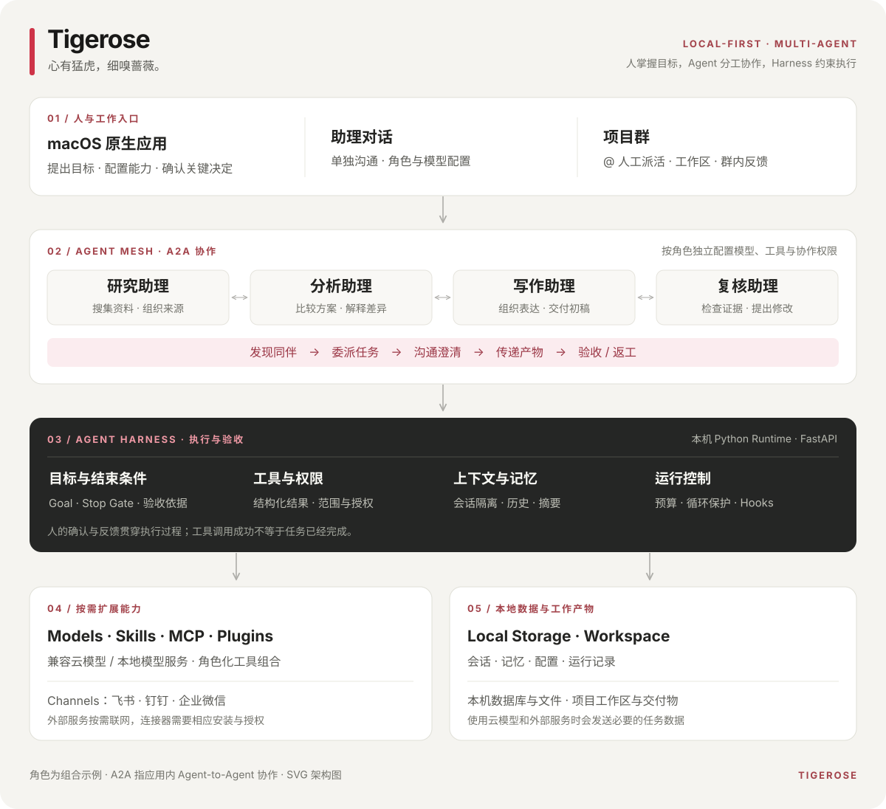

<div align="center">

# Tigerose · 本地优先的多 Agent 协作 Mac APP

**心有猛虎，细嗅蔷薇。**

让专业助理各司其职，让多个 Agent 一起把项目向前推进。

**Multi-Agent · A2A Collaboration · Agent Harness · Local-First · macOS**

[下载安装](#下载安装) · [核心卖点](#核心卖点) · [产品架构](#产品架构) · [开始使用](#开始使用)

</div>

Tigerose 是面向 macOS 的本地优先 AI Agent 协作应用。你可以创建不同角色的 AI 助理，为每位助理配置模型、Skills、MCP 与 Plugins，再通过项目群派发工作，或授权助理之间开展 A2A（Agent-to-Agent）协作。

从调研、分析到撰写与复核，Tigerose 把**人的目标、多角色分工、工具执行和结果验收**放进一个可操作的工作环境。它也为研究 Agent Harness 架构的产品经理和工程师，提供从原生界面到本地运行时的完整观察视角。

## 核心卖点

### 1. 多角色 Agent 协同：让专业能力组成团队

一个项目经常需要多种能力：有人查资料，有人做分析，有人组织表达，也有人检查结论。Tigerose 支持把这些职责拆成独立助理，让每个 Agent 拥有自己的角色说明、模型、工作方式和能力范围。

你可以按真实工作习惯组织团队：

| 助理角色示例 | 负责的工作 | 交付目标示例 |
| --- | --- | --- |
| 研究助理 | 搜集资料、整理来源、梳理问题 | 带来源的研究摘要 |
| 分析助理 | 比较方案、处理数据、解释差异 | 分析表与判断依据 |
| 写作助理 | 组织结构、起草内容、修改表达 | 可继续编辑的文档 |
| 复核助理 | 检查遗漏、质疑结论、提出修改 | 问题清单与复核意见 |

这些是可自行创建的角色组合，你可以把它们换成适合自己的产品、研发、运营或日常办公团队。

**A2A 协作把“找人帮忙”变成可追踪的任务关系。** 在你允许的协作范围内，助理可以发现同伴、委派任务、澄清问题、传递产物，并对交付进行验收或要求返工。你不必在多个对话之间反复复制同一份背景资料，也能查看协作任务的进展和结果。

自主协作的边界由你设置：哪些助理接收协作任务、谁可以联系谁，以及各自能调用什么工具。助理沿用自己的权限；加入同一个项目群，不会自动获得其他助理的全部能力。

*这里的 A2A 指 Tigerose 内部的 Agent-to-Agent 协作，不表示已兼容跨平台 A2A 标准协议。*

### 2. 项目群：你来派活，多 Agent 共同推进

需要掌握分工和节奏时，你可以创建一个项目群，加入相关助理，绑定工作区，通过 `@` 把任务交给一位或多位成员。讨论、派发和反馈集中在同一个群里，工作产物落在项目工作区。

例如，准备一份竞品研究：

> @研究助理 整理三款产品的定价、目标用户与信息来源。  
> @分析助理 根据已有材料比较差异，指出还缺哪些证据。  
> @写作助理 将确认后的结论整理成汇报初稿。

你可以先派发彼此独立的工作，再根据返回结果继续安排后续任务；也可以调整成员、补充约束，把复核意见交给负责的助理。**目标、优先级和最终取舍始终由你掌握。**

项目群与 A2A 分别服务两种协作方式：前者适合人工明确派活，后者适合在授权范围内由助理主动协商。两者结合，既能保留人的判断，也能减少重复协调。当前项目群使用显式 `@` 派发，不会把没有指定对象的消息自动分配给任意成员。

对办公人员，这意味着可以把一个大任务拆成可检查的小交付；对产品经理，这是一套能实际体验“人如何管理 Agent 团队”的交互模型。

### 3. 融合前沿理念的 Agent Harness：让执行有边界、交付有依据

**模型决定下一步做什么，Harness 负责让这一步在正确的上下文、工具和权限中发生。** Tigerose 把这个执行环境作为核心：不仅提供角色提示词，也管理目标、工具调用、上下文、协作和结束条件。

Tigerose 的设计吸收 Claude Code、Codex、Hermes 等 Agent 产品与框架的理念，并围绕 Mac 桌面工作流组织实现。其中，Hook 设计参考 Claude Code 的事件匹配与处理范式；Goal、运行状态与验收边界的设计包含对 Codex 的分析。它是独立项目，具体能力以自身实现为准。

| Harness 机制 | 对实际工作的价值 |
| --- | --- |
| **结构化工具执行** | 通过明确的工具结果和状态判断发生了什么，降低把输出文本误当成执行结果的风险。 |
| **Goal 与 Stop Gate** | 将目标、任务状态和验收依据连接起来，为“什么时候可以结束”提供约束。 |
| **执行与验收分离** | 区分调用成功和目标达成；适用场景下检查消息、文件等实际交付证据。 |
| **权限与操作范围** | 按助理约束工具、文件访问和高影响动作，需要确认时将决定交回给人。 |
| **上下文与记忆管理** | 管理历史、摘要、作用域和记忆候选，帮助持续工作保留必要背景。 |
| **循环与预算控制** | 对重复调用、资源消耗和协作任务设置运行边界，减少无效尝试。 |
| **Hook 与运行记录** | 在关键执行阶段接入处理逻辑，并保留可检查的过程信息，便于调试和改进。 |

对于研究 Harness 的产品经理，这些机制对应的是可见的产品决策：何时询问用户、怎样展示任务状态、什么才算“完成”。对于工程师，它们对应可阅读的模块边界：Executor、RunLoopGuard、GoalAcceptance、Agent Mesh、权限与上下文管理。

Tigerose 希望把先进 Agent 架构的讨论带到可以运行、观察和验证的桌面应用里。它不承诺任何任务都能自主完成，也不将尚未默认启用的实验性工作流作为已交付能力。

### 4. 本地优先，助理能力自主配置

Tigerose 使用原生 macOS 界面和本机 Python 后端。会话、记忆、配置与工作文件以本地存储为基础；你可以使用兼容的云模型服务，也可以连接 LM Studio 等提供兼容接口的本地模型服务。

**每位助理的能力组合都可以由你定义。** 同一个应用里，研究助理可以专注搜索与资料处理，工程助理可以使用代码工具与项目工作区，写作助理可以加载相应 Skills；无需把所有能力一股脑开放给每个角色。

| 配置维度 | 你可以决定什么 |
| --- | --- |
| **模型 Models** | 模型、接口地址与凭据；按任务选择能力、速度与成本的平衡。 |
| **技能 Skills** | 为角色加载可复用的方法、步骤和领域知识。 |
| **MCP** | 按需接入外部工具和数据服务，拓展助理能完成的工作。 |
| **插件 Plugins** | 组合角色、资源与能力配置，复用已有扩展。 |
| **工具与权限** | 确定允许的操作、访问范围及协作边界。 |
| **频道 Channels** | 配置飞书、钉钉、企业微信等工作入口，并将机器人绑定到助理。 |

能力可以随项目变化逐步增加：先用模型和本地文件开始工作，需要搜索、办公系统或消息入口时再连接。频道和外部工具需要各自的安装或授权；企业微信桥接还需要本机 Node.js。

本地优先也意味着边界透明：**调用云模型或外部服务时，完成任务所需的数据仍会发送到对应服务。** 模型和工具选择由你掌握，本地模型能否完成某项任务取决于其工具调用能力与具体配置。

## 适合谁使用

| 你是谁 | Tigerose 能帮助你探索或完成什么 |
| --- | --- |
| **研究 Harness 的产品经理** | 体验角色、协作、权限、记忆、人工介入与验收如何组成一个 Agent 产品。 |
| **Agent / AI 工程师** | 阅读 SwiftUI 与 Python 运行时，研究多 Agent 调度、工具契约和执行边界。 |
| **希望提效的办公人员** | 组织资料搜集、分析、起草和复核，让专业助理协作推进日常工作。 |

## 产品架构



人通过助理对话和项目群提出目标；多角色 Agent 在授权范围内协作；Harness 管理执行、权限与验收；模型和扩展提供能力，本地数据层保存工作状态。

## 下载安装

**[下载 Tigerose DMG（Apple Silicon）](https://github.com/Kz-Aven/Tigerose/releases/download/v0.1.7/Tigerose-0.1.7-20260924-arm64.dmg)** · [全部 Releases](https://github.com/Kz-Aven/Tigerose/releases)

支持 **Apple Silicon（M 系列芯片）与 macOS 14 或更新版本**。安装包内置 Python 运行时，基础使用无需自行安装 Python 或编译源码。

1. 下载 Release 中的 `.dmg`，双击打开。
2. 将 **Tigerose** 拖入 **Applications（应用程序）**。
3. 启动 Tigerose，按引导完成配置。

当前本地构建使用临时签名，尚未完成 Apple 公证。若 macOS 阻止打开，请在确认下载来源后，按系统提示到“系统设置 → 隐私与安全”允许打开。扩展频道或连接器可能需要额外运行环境和平台授权。

## 开始使用

### 第一步：配置模型

首次启动时填写模型 ID、Base URL 和 API Key，再选择默认工作区。可以使用兼容的云模型接口，也可以连接已启动的本地模型服务。

### 第二步：创建助理

点击 **新建助理**，填写名称、角色和工作说明。按需要配置模型、Skills、MCP、Plugins 和权限；例如创建一位“研究助理”，要求其标明来源并区分事实与推测。

### 第三步：发出任务，开启工作

进入助理对话，说明目标、输入材料和交付要求即可开始：

> 阅读工作区里的资料，整理一份项目进展摘要，列出已完成事项、待解决问题和需要我确认的决定。

需要多人协作时，创建项目群、加入助理并 `@` 派活；希望助理主动寻求同伴帮助时，再配置 A2A 协作权限。

## 架构研究与源码入口

| 路径 | 内容 |
| --- | --- |
| [`macos/TigeroseAgent/`](macos/TigeroseAgent/) | 原生 macOS 界面、对话、项目群与能力设置 |
| [`server/runtime/`](server/runtime/) | Agent Harness、Goal、工具执行、权限、上下文与协作 |
| [`server/runtime/tools/mesh.py`](server/runtime/tools/mesh.py) | Agent-to-Agent 委派、沟通、交付与验收工具 |
| [`server/api/`](server/api/) | 客户端与本地引擎之间的 API |
| [`macos/Packaging/build_dmg.sh`](macos/Packaging/build_dmg.sh) | 构建独立 DMG 安装包 |

开发环境需要 Apple Silicon Mac、Xcode Command Line Tools 与 Python。安装依赖后启动：

```bash
python3 -m pip install -r requirements.txt
./script/build_and_run.sh
```

构建脚本会重启本地应用，请先结束正在执行的任务。

## 反馈与交流

欢迎通过 [GitHub Issues](https://github.com/Kz-Aven/Tigerose/issues) 提交使用反馈、可复现的问题和协作场景。讨论 Harness 时，也欢迎附上目标、执行过程和验收结果，帮助定位具体的设计取舍。

**Tigerose — 心有猛虎，细嗅蔷薇。让执行有力量，让协作有分寸。**
